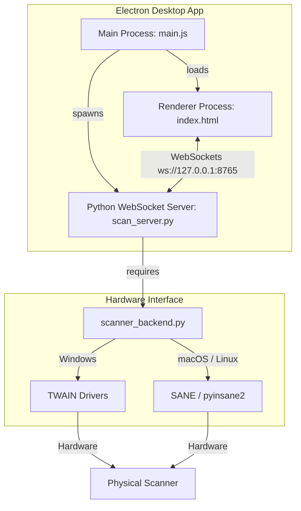

# WebScan — Premium Cross-Platform Scanner Application

WebScan is a beautifully designed, highly interactive, cross-platform document scanning application that bridges the gap between hardware scanners and modern web/desktop technology. It provides real-time multi-page document scanning, automatic document feeder (ADF) handling, duplex support, and instant PDF generation.

---

## 🚀 Key Features

* **Desktop Native & Web Browser Support**: Run it as a standalone premium Electron desktop app or host it as a web service accessible by any browser in your local network.
* **Unified Lifecycle Management**: The desktop app automatically initializes the backend scanning daemon and terminates it on exit—no CLI operations required.
* **Hardware Interoperability**: Seamlessly orchestrates native scanner protocols across all platforms:
  * **Windows**: TWAIN (via `pytwain`)
  * **macOS**: SANE / ImageCaptureCore (via `pyinsane2`)
  * **Linux**: Native SANE daemon (via `python-sane`)
* **Real-time Page Streaming**: Stream scanned page thumbnails over WebSockets in real time instead of waiting for long scanner hardware procedures to complete.
* **Smart PDF Export**: Export scanned pages directly to standard A4 PDF documents.

---

## 🏗️ System Architecture



---

## 🛠️ Step-by-Step Installation

### Step 1: Install System Dependencies

* **Windows**: None! Scanner-compliant TWAIN drivers ship natively with your hardware.
* **macOS**: Install SANE backends via Homebrew:
  ```bash
  brew install sane-backends
  ```
* **Linux (Ubuntu/Debian)**: Install SANE development libraries:
  ```bash
  sudo apt install libsane-dev
  ```

### Step 2: Set Up Virtual Environment

Initialize the workspace virtual environment by running the automated setup script. This will create a local `.venv` folder and install necessary libraries (`websockets`, `Pillow`, `fpdf2`, and platform-specific scanner drivers):

```bash
python setup.py
```

---

## 🎮 How to Run

### Option A: Electron Desktop App (Recommended)
This starts the backend WebSocket server and launches the premium Electron desktop application automatically in a single unified command:

```bash
npm install
npm start
```

### Option B: Standalone Web Server Mode
If you prefer to host it in your local network or run it in a standard web browser:

1. **Start the scanner server**:
   ```bash
   python run.py
   ```
2. **Open the interface**:
   Simply open [index.html](file:///c:/Users/aroma/Documents/GitHub/scanner-app/index.html) in any modern web browser.

---

## 💡 Troubleshooting

| Symptoms | Root Cause | Actionable Fix |
|---|---|---|
| **"No scanners found" on macOS** | SANE backends missing | Run `brew install sane-backends` and restart server. |
| **"No scanners found" on Linux** | SANE dev packages missing | Run `sudo apt install libsane-dev` and restart server. |
| **"Cannot reach server" error** | Backend daemon not running | Ensure `python run.py` or `npm start` is active. |
| **PowerShell blocks virtualenv script** | Execution policy restriction | Run: `Set-ExecutionPolicy -Scope CurrentUser RemoteSigned` |
